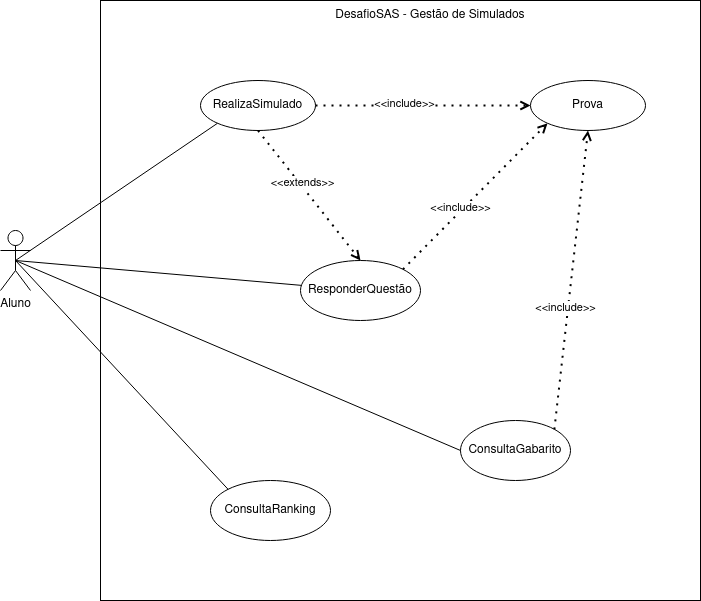
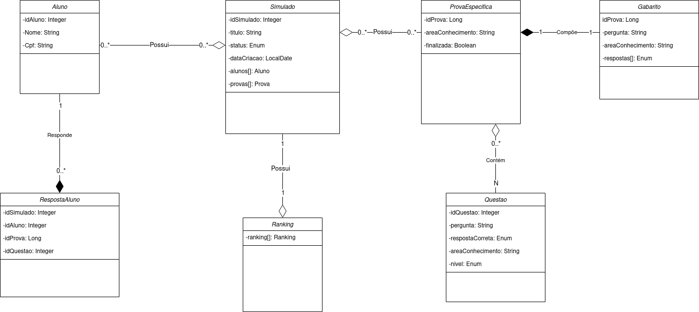
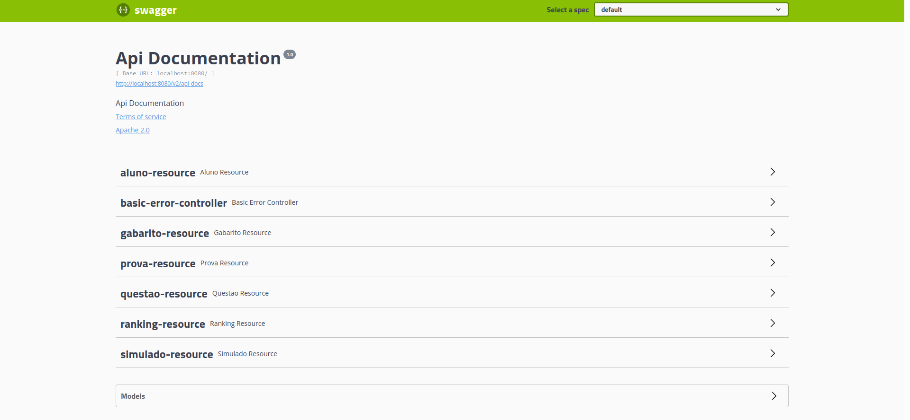

<h1 align="center">
  Desafio SAS - Gerenciador de Simulados
  <br>
</h1>

<!-- <h4 align="center"></h4> -->

<p align="center">
    <a alt="Java">
        
    </a>
    <a alt="Spring Boot">
        
    </a>
    <a alt="Flyway">
        
    </a>
    <a alt="Swagger-UI">
        
    </a>    
</p>

## Índice ##
1. [Descrição do desafio](#Descrição-desafio)
2. [Tecnologias](#Tecnologias)
3. [Diagramas UML](#Diagramas-UML)
4. [Esquema Banco de Dados](#Esquema-Banco-de-Dados)
5. [Requisitos](#Requisitos)
6. [Instruções de uso](#Instruções-de-uso)
7. [Documentação REST](#Documentação-REST)


## Descrição do desafio ##

* [https://github.com/felipeas314/backend-teste-sas](https://github.com/felipeas314/backend-teste-sas)


## Tecnologias ##
Following libraries were used during the development of this starter kit :

- **Maven** - Software de gerenciamento de projetos
- **Spring Boot** - Framework de aplicações Java
- **PostgreSQL** - Banco de dados SQL
- **Flyway** - Framework de migrations 
- **Docker** - Framework de conteinerização
- **Swagger** - Documentação de API


### Diagrama de Caso de Uso ###

</a>

### Diagrama de Classes ###

</a>


## Esquema Banco de Dados ##

</a>

  

## Instruções de uso ##

**1. Clonar repositório**

**2. Criar banco de dados PostgreSQL**
```bash
CREATE DATABASE desafiosas;
```

**3. Configurar username e password do postgres no properties**

+ Caminho: `src/main/resources/application.properties`

**4. Build e start usando maven**

```bash
./mvnw clean && ./mvnw package
java -jar target/desafio-0.0.1-SNAPSHOT.jar
```

Aplicação estará disponível em <http://localhost:8080>.

## Documentação REST ##

Os recursos REST da api estão documentados com Swagger, disponíveis uma vez que o projeto esteja rodando: [http://localhost:8080/swagger-ui.html](http://localhost:8080/swagger-ui.html)

</a>
  

## Contribuidores ##
[Lucas Tavares](https://www.linkedin.com/in/lucas-tavares-a25323116/)
